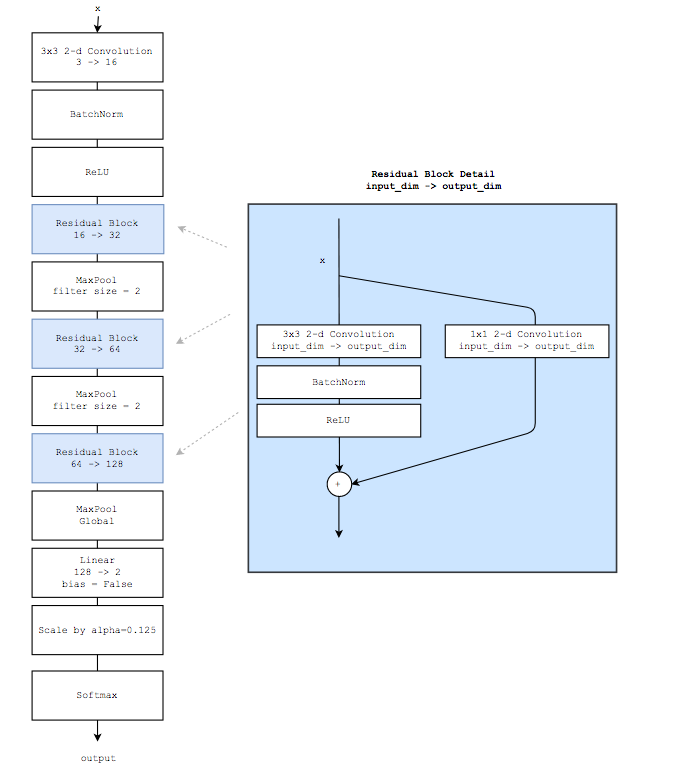

# convnet

__Task:__ Implement a convolutional neural network (CNN) for image classification.

Image classification using a CNN is probably the most famous application of deep learning -- image classification was a relatively difficult machine learning problem in the past, but CNNs have dramatically improved the state of the art on the task over the past 5-10 years.

There are many blog posts and tutorials that give background on CNNs applied to image classification:
 - [Fastai video](https://course.fast.ai/videos/?lesson=1)
 - [Simple Introduction to CNNs](https://towardsdatascience.com/simple-introduction-to-convolutional-neural-networks-cdf8d3077bac)
 - [Keras tutorial](https://blog.keras.io/building-powerful-image-classification-models-using-very-little-data.html)
 - [Pytorch tutorial](https://pytorch.org/tutorials/beginner/blitz/cifar10_tutorial.html)

### Algorithm Overview

These days, CNNs are almost always trained on a graphics processing unit (GPU) instead of the CPU.  GPU training is roughly 10x faster than CPU training.  Since we're not assuming you have access to a GPU for this exercise, we'll be training a relatively small CNN on a small dataset (10k 32x32 images).  A state of the art CNN would be far larger (more parameters) and would be trained on far more data (eg, 1Ms of 224x224 images).

The architecture we want you to implement is a simplified residual network (ResNet).  In some CNNs, the data "flows" through the network along a single path through all of the layers -- ResNets add "skip connections" that allow information to skip some of layers of the network.  Experiments have shown that this modification improves the stability and quality of CNN models.  (For further details, the original ResNet paper is [here](https://arxiv.org/pdf/1512.03385.pdf))

The specific architecture you're to implement is shown in the following diagram:



##### Architecture details

- In the diagram, `input_dim -> output_dim` specifies the number of input and output channels of a block

- 2d Convolution
    - All convolutional layers should have a stride of 1
    - The spatial dimension of convolutional layers' input and output should be the same. Eg:
        - A 3x3 2d convolution adds one pixel of zero padding to each border
        - A 1x1 2d convolution adds no padding
    - All convolutional layers have no bias
    - Weights in convolutional layers are initialized as follows
        - 1x1 convolution: `W ~ RandomUniform(-scale, scale)` where `scale = sqrt(1 / (input_channels))`
        - 3x3 convolution: `W ~ RandomUniform(-scale, scale)` where `scale = sqrt(1 / (9 * input_channels))`
        - nxm convolution: `W ~ RandomUniform(-scale, scale)` where `scale = sqrt(1 / (n * m * input_channels))`

- BatchNorm
    - BatchNorm in `pytorch` or `tensorflow` keeps a running mean of batch statistics and has some learnable parameters.  To make things easier, you should just implement BatchNorm as the function `batchnorm(x) = (x - channel_means) / sqrt(channel_vars + 1e-5)`.  
      - Thus, if `x` has shape `(batch_size, channels, width, height)`, then 
        - `channel_means[i] = mean(x[:,i,:,:])`
        - `channel_vars[i] = var(x[:,i,:,:])`
      - This is equivalent to `BatchNorm2d(channels, eps=1e-5, momentum=None, affine=False, track_running_stats=False)` in `pytorch`
      - __Hint:__ Some libraries may require you to set your model to `train` and `eval` mode to ensure that BatchNorm behaves properly.  Making predictions while the model is in `train` mode may result in an annoying-to-debug drop in accuracy.

- MaxPool
    - A MaxPool with filter size 2 maps an input of size `(channels, width, height)` to an output of size `(channels, width / 2, height / 2)`.
    - A "global" MaxPool maps an input of size `(channels, width, height)` to an output of size `(channels, 1, 1)`

- Scale
    - A scale operator w/ parameter `alpha` takes an input `x` and returns output `alpha * x`

- Linear
    - Linear layers have no bias
    - Weights are initialized as `W ~ RandomUniform(-scale, scale)` where `scale = sqrt(1 / input_dim)`
The components that make up this architecture are quite standard, and you can find further details by looking at Pytorch or Keras documentation.  Terminology and default parameters may differ somewhat, but the concepts are the same.

The only exception is the "scale" block, which is a less common NN component, but can help models converge more quickly.

##### Training procedure details

- Train your model using the categorical cross entropy loss.  That is, if 
  - `pred` is a `num_classes` dimensional vector output by the softmax layer of the network
  - `act` is a `num_classes` dimensional vector of one-hot encoded labels
   then the categorical cross entropy loss is defined as:
  ```python
  def categorical_cross_entropy(Vector[float] act, Vector[float] pred):
      ent = 0
      for i in range(num_classes):
          ent += act[i] * log(pred[i])

      return -1 * ent
  ```
  To compute the loss for a minibatch, compute the loss for each observation and take the _mean_.
  
- Train for 5 epochs with a batch size of 128
- Shuffle the training data each epoch
- Use standard stochastic gradient descent (SGD)
    - Start with a learning rate of 0.1, but reduce it linearly to 0 over the course of training.
      - This is a trick to help the model converge more quickly.
    - Use momentum of 0.9.  Do not use Nesterov momentum.
    - If you need to implement your own optimizer, you can look at [pytorch](https://pytorch.org/docs/stable/_modules/torch/optim/sgd.html) as a reference.  Simplified versions of their optimizers can be seen [in this gist](https://gist.github.com/bkj/77bf8eabb52b1dfac41c69085e07fd3d)

__Note:__ The _exact_ details of how the SGD optimizer implemented probably shouldn't matter -- Tensorflow implementations may be slightly different than Pytorch implementations may be different from custom implementations, but the quality of the model should be the same.  If you _strongly_ suspect that you're having trouble that's tied to either of these parts of the model, please reach out for support.

#### Evaluation

__To be considered correct, your model needs to attain an accuracy of over 95% on the held-out test set after 5 epochs of training.__

#### Notes

Our `pytorch` reference implementation runs in:
  - about 5 seconds on a GPU (P100)
  - about 40 seconds on a CPU (8 threads; Intel(R) Xeon(R) CPU E5-2698 v4 @ 2.20GHz)

Training progress on our model looks like:
```
{"epoch": 0, "test_acc": 0.878,  "time": 8.479886770248413}
{"epoch": 1, "test_acc": 0.9445, "time": 16.883798599243164}
{"epoch": 2, "test_acc": 0.9525, "time": 25.423847913742065}
{"epoch": 3, "test_acc": 0.96,   "time": 33.07490062713623}
{"epoch": 4, "test_acc": 0.965,  "time": 40.27085995674133}
```

#### References

See above.
