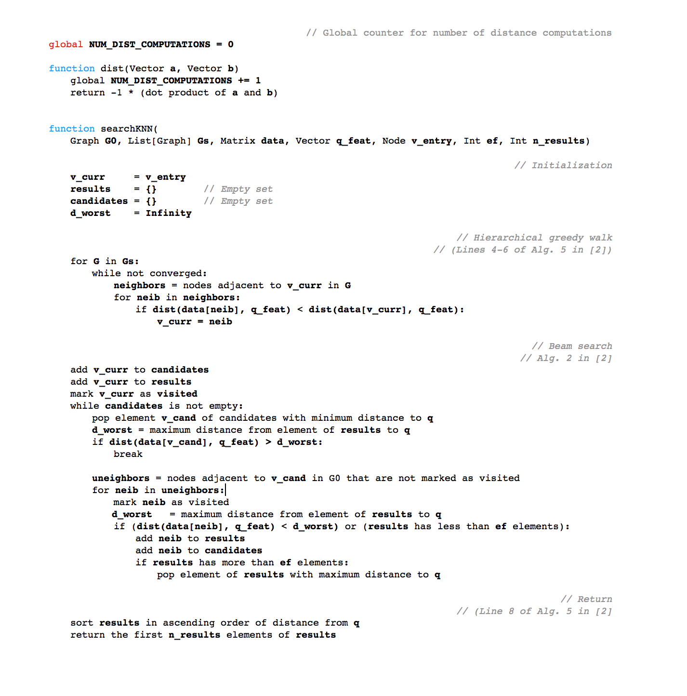

# IP-NSW

__Task:__ Implement the query portion of the IP-NSW algorithm for approximate maximum inner product search (MIPS). 

Given a set of `d`-dimensional vectors `X` and a query vector `q`, the goal of MIPS is to find the `K` elements of `X` that have the largest inner product with `q`.  

The inner product is a commonly used measure of similarity between two vectors.  Thus, being able to find elements that have a large inner product with your query is useful for things like search engines or recommender systems.  

As a quick reminder, to compute the inner product of two `d`-dimensional vectors `a` and `b`, you sum the products of the elements as follows:

```python
function inner_product(Vector a, Vector b, int dim):
    out = 0
    for i in range(dim):
        out += a[i] * b[i]
    
    return out
```

The naive "brute force" way to do MIPS would be to compute the inner product between the query `q` and every element of `X`.  This requires multiplying `(# vectors in X) * d` numbers per query -- if `X` is very large and/or you have to do lots of queries, this becomes computationally expensive and slow.  Algorithms like IP-NSW try to reduce the cost of each query by building a special data structure called an "index" that can be used to do cheap, fast and approximate MIPS.  

### Algorithm Overview

IP-NSW is a "hierarchical similarity graph"-based retrieval algorithm.  The abbreviation stands for "Inner Product Navigable Small World".

#### Indexing

When the index data structure is created, IP-NSW creates `N` graphs: nodes in each graph correspond to vectors in `X` and an edge `(u, v)` indicates that the vector corresponding to node `v` is highly similar to the vector corresponding to node `u`.  Note that these graphs are directed -- the existence of edge `(u, v)` does _not_ imply the existence of edge `(v, u)`. The `N` different graphs have different sizes and different "levels" of coarseness.  Graphs at a high "level" have a small number of nodes, each of which can be interpreted as representing cluster centroids in `X` -- these coarse graphs give you a very general map of the vectors in `X`.  Graphs at a lower level have a larger number of nodes and encode more fine-grained information about `X`. 

__We are not asking you to implement this indexing procedure__, so we'll skip some of the details about how these graphs are constructed.  Details are available in [1] and [2].

#### Searching

You'll be implementing the "search" portion of the IP-NSW algorithm.

When we do a search, we'll "zoom in" from the coarsest similarity graph to the finest.  Given a query `q`, this can roughly be interpreted as "find a large cluster that `q` is close to, then find a subcluster that `q` is even closer to, then find a subcluster ...".

By analogy: if you're trying to efficiently find all of person `q`'s family members, you might start by
 1) finding all the people from the same country as `q`, then
 2) finding all of the people from the same state as `q`, then
 3) finding all of the people from the same city as `q`, etc

Maybe you can see how this could improve the efficiency of your search: after the first step, you don't have to think about most of the people in the world anymore, so your search will be faster.  But this speed will probably come at the cost of reduced accuracy -- some of your filters may remove candidates too aggressively (eg, `q`'s family members that live in a different country).

More specifically, at search time, we start at a set "entrypoint node" at the highest level (corresponding to the coarsest and smallest graph).  At each step, we "greedily" walk to the neighbor of the current node with the maximum similarity to our query vector.  When our walk reaches a local maximum where no neighbors have higher similarity than the current node, we'll "descend" to the next coarsest level and continue the walk.  When we reach the least coarse level (called level 0 in papers [1] and [2]), we switch to a "beam search" procedure that explores the graph more thoroughly than a random walk.  (illustrated in Figure 1 in [2])

The pseudocode for the algorithm we want you to implement is shown below.  This is a combination of Algorithm 2 and Algorithm 5 in [2], rewritten to improve clarity.



Notice we've added a counter that records the number of times that the distance function is evaluated.  You need to do this so we can check the correctness of your implementation -- a correct implementation should call this function far fewer times than a brute force search.

Also notice that `dist` returns the _negative_ inner product -- if inner product is a measure of similarity, it's negative is a measure of dissimilarity or (loosely) "distance".


### Notes

__Hint:__ Algorithmically, `results` and `candidates` can be efficiently implemented using heaps.

__Note:__ Some readers may be familiar with other data structures that can be used to speed up nearest neighbor lookups.  MIPS is a slightly different problem, because the inner product is not a metric space.  Also, IP-NSW is designed to be performant when the dimension of the vectors is large (10s-100s), where many of these other methods do poorly.


### Evaluation

__To be considered "correct", your implementation must both:__

 - achieve a `recall@10` score of > 0.99; and
 - use < 1% of the number of distance function evaluations compared to brute force search

on the provided dataset.

`recall@k` is defined as the proportion of the actual `k` most similar elements of `X` to `q` that are present in the `k` elements returned by the IP-NSW search, averaged across all queries.  `compute_score` in `main.py` contains this definition in code.

### References

- [1] [S. Morozov, A. Babenko. Non-metric Similarity Graphs for Maximum Inner Product Search. Advances in Neural Information Processing Systems 32 (NIPS 2018).](https://papers.nips.cc/paper/7722-non-metric-similarity-graphs-for-maximum-inner-product-search.pdf)
- [2] [Yury A. Malkov and D. A. Yashunin. Efficient and robust approximate nearest neighbor searchusing hierarchical navigable small world graphs.CoRR, abs/1603.09320, 2016.](https://arxiv.org/ftp/arxiv/papers/1603/1603.09320.pdf)
