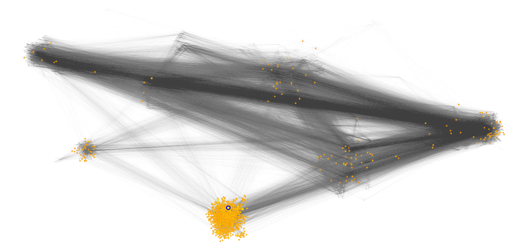
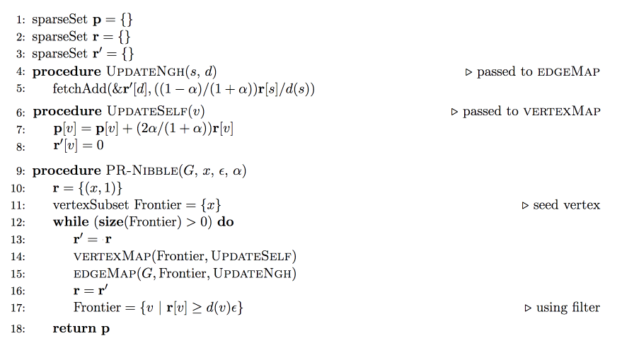
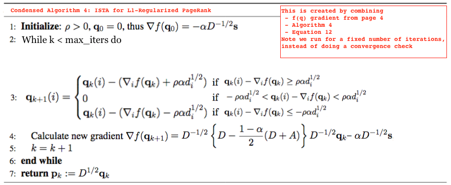

# lgc (local graph clustering)

__Task:__ Implement the PR-Nibble and ISTA algorithms for personalized PageRank.

PageRank is an algorithm that computes the "importance" of each node in a network, and is well known for (among other things) forming the basis of Google's search engine (higher PageRank -> web page is more important -> should be ranked higher in the search results). While the original PageRank computes the global importance of each node, "personalized PageRank" computes the importance of each node _from the perspective of a particular seed node._  Some more background on PageRank can be found in Section 3 of [3].

"Local graph clustering" (LGC) methods are approximate variants of personalized PageRank.  Given a seed node in a network, the goal of LGC is to find a cluster of nodes that are "nearby" the seed.  As a concrete example, consider the social network of students at a university: nodes represent students and links between nodes indicate that pair of students have met each other.  The following illustration shows the results of running an LCG algorithm using the blue circled node as the seed:



The yellow-orange nodes indicate nodes that are predicted to be in the same cluster as the blue node.  LCG appears to be working -- most of the orange nodes are in the visible highly-connected cluster containing the blue circled node.  The yellow and orange nodes sparsely scattered throughout the rest of the network indicate some "false positive" nodes that are mistakenly added to the cluster by the LCG algorithm.

Some further information about local graph clustering can be found in [2].

### Algorithm Overview

In this task, you'll implement two different LCG algorithms which again, are both approximate variants of personalized PageRank.  

#### Algorithm 1: PageRank-Nibble

Parallel PageRank-Nibble is described in in Section 3.3 of [1]. At a high level, the algorithm works as follows:
  - each node `i` in the graph gets two new quantities, `p[i]` and `r[i]`.  `p` values will indicate the PageRank score, and `r` holds a "residual"
  - add 1 unit of "mass" to `r[seed]`
  - iteratively, for each node `i` with "enough residual" `r[i]`
    - transfer some proportion of the mass in residual `r[i]` to PageRank value `p[i]`
    - distribute some proportion of the remaining mass in residual `r[i]` equally to the residuals of `i`'s neighbors

"Enough residual" and "some proportion" are parameters of the algorithm that impact the locality and precision of the algorithm.  Once no nodes have enough residual to continue, the algorithm terminates and returns `p[i]` for each node.  See Section 3.3 of [1] for a more in-depth description.

Figure 6 in [1] gives pseudocode for a couple of variants of the PR-nibble algorithm. Specifically, we want to implement __optimized parallel PR-nibble__. To avoid confusion, pseudocode for the exact variant of the algorithm that we want you to implement is shown below:



__Note:__ This is a combination of Fig 5 and Fig 6 in [1], plus correction of a typo on Fig 5 line 13.

In the pseudocode above:
 - `d(v)` is a function that returns the degree of vertex `v`.  `epsilon` and `alpha` are parameters.
 - `vertexMap(set Frontier, function fn)` is a function that calls `fn(x)` on each node `x` of `Frontier`
 - `edgeMap(graph G, set F, function fn)` is a function that calls
 ```
for each node x in F
    for each node neib adjacent to x in G
        fn(x, neib)
 ```

__Note:__ The algorithm is called "parallel PR-nibble" because the `vertexMap` and `edgeMap` _can_ be parallelized.  This does not mean that they _must_ be parallelized -- we highly recommend you implement a serial version of this algorithm first, and only add parallelization as an optimization once you have an implementation that passes the correctness checks.

#### Algorithm 2: ISTA for L1-Regularized PageRank

This algorithm frames the PageRank computation as an optimization problem, and uses an version of the ISTA optimization algorithm to solve it.  The algorithm is described in [3], which is a pretty math-heavy paper: read as much as you can understand (definitely try at least the first 3 sections), but grasping all of the proofs is not necessary for the programming task.

To help you implement the algorithm, we provide the following pseudocode.  This is based on Algorithm 4 from [3], but highly condensed to improve readability.



In the pseudocode above
 - The upside down triangle indicates the gradient operator
 - `v(i)` indicates the i'th element of vector `v`
 - `d_i` is the degree of vertex `i` in the graph
 - `D` is a diagonal matrix where `D[i,i]` is the degree `d_i` of vertex `i` in the graph
 - `D ** (-1 / 2)` is a diagonal matrix where `(D ** (-1 / 2))[i,i] = 1 / sqrt(d_i)`
 - `A` is the adjacency matrix of the graph
 - `s` is a vector with zero entries everywhere except for `s[seed_node] = 1`
 - `q_k` and `grad f(q_k)` are vectors. `grad_i f(q_k)` is the i'th element of `grad f(q_k)`.
 - `alpha`, `rho` and `max_iter` are user-supplied parameters

To help relieve ambiguity coming from unfamiliar notation, you can also refer to [this alternative pseudocode](https://gist.github.com/bkj/6a7b9db8408d27da255bec6438de655b)

### Notes

The included python code in `main-redacted.py` gives a skeleton for your solution, including relevant hyperparameters.

Notice that we are asking you to compute PR-Nibble and ISTA scores for 10 different seed nodes.  Thus, the output of each function should be an array of size `(num_nodes, num_seeds)`. 

__Beware:__ The LGC literature sometimes talk about using multiple seeds to compute a _single_ PageRank vector -- the interpretation of this is computing importance scores of each node _from the perspective of a set of nodes_.  __That is not what we want you to do.__ We want you to compute a separate PageRank vector _for each of the seed nodes_.  

During optimization, you might be able to exploit the fact that we're computing a bunch of vectors at the same time by e.g. using parallelism, vectorizing computations, or reframing the algorithm using matrix multiplication.  We suggest you implement a version that works for a single seed node first before moving on to these kinds of optimizations.

### Evaluation

We consider a solution to be correct if it's Spearman correlation with the reference output is above 0.999 _for all seed nodes._

A correct solution will print something like the following output:
```bash
parallel_pr_nibble: elapsed = 5.717706
parallel_pr_nibble: PASS
ista: elapsed = 0.446789
ista: PASS
```

__Your system needs to `PASS` on both `parallel_pr_nibble` and `ista` to be considered completely correct.__

Resources:
 - [1] [Parallel Local Graph Clustering, Shun et al.](https://arxiv.org/pdf/1604.07515.pdf)
 - [2] [A Short Introduction to Local Graph Clustering Methods and Software, Fountoulakis et al](https://arxiv.org/pdf/1810.07324.pdf)
 - [3] [Variational Perspective on Local Graph Clustering](https://arxiv.org/pdf/1602.01886.pdf)
