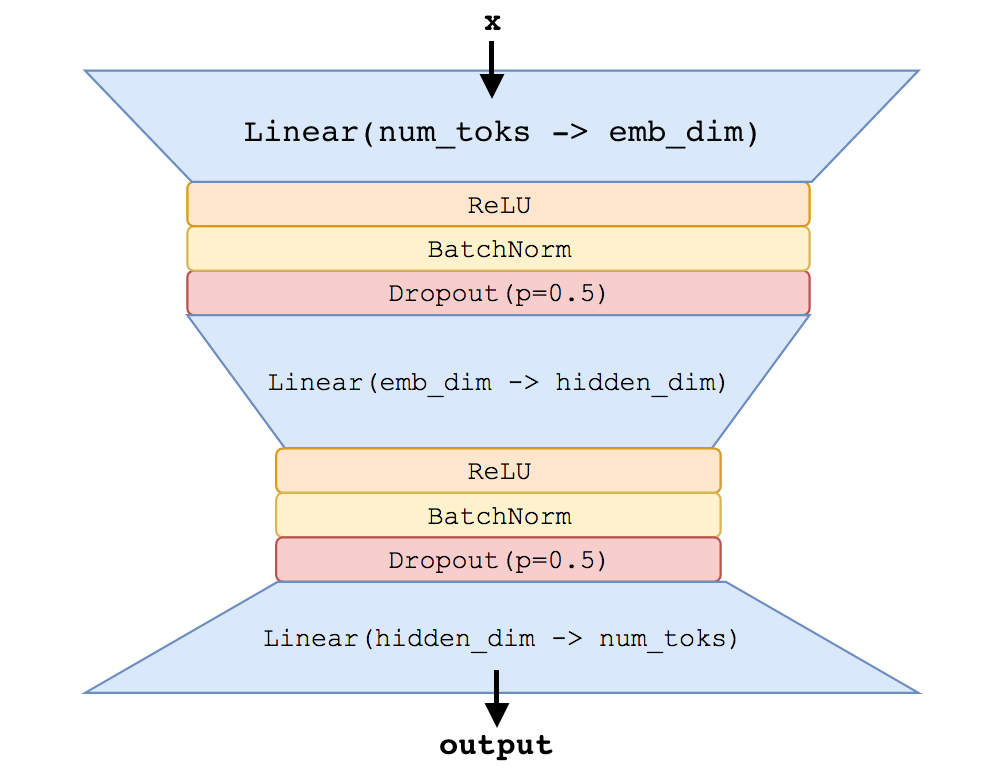

# recsys (Autoencoder-based Recommender System)

__Task:__ Implement and train a neural-network based recommender system. 

Specifically, the neural network is an autoencoder that takes a list of items that a person has "liked", and predicts a score for all items. Autoencoders are neural network models where the input and the target are the same.  That is, if `f` is a function parameterized by a neural network, autoencoders try to minimize `loss(x, f(x))`.

Why is this difficult?  Won't `x` just learn to predict the identity function to map `x` to `x`?  The answer is no, because autoencoders are always designed to have a "bottleneck" in the middle -- `x` is first "encoded" to a "hidden representation" `h`, where `dimension(h) < dimension(x)`, and then `h` is "decoded" back to `x`.  By mapping the input through a lower dimension, we prevent the model from learning the identity function and force it to learn something about the structure of the data.

## Model Description

You'll build a neural network model with the architecture shown below:



The input to the network is a `num_items`-dimensional vector `x` representing a user's history.  `x[i] == 1` if the user liked the item, and `x[i] == 0` if the user did not like the item.  Given `x` the forward pass through the network is as follows 

(Note: `@` indicates matrix multiplication and `*` indicates elementwise multiplication).

```
h1 = dropout(batchnorm(relu(x @ W_embedding)))
h2 = dropout(batchnorm(relu(h1 @ W_bottleneck + B_bottleneck)))
h3 = sigmoid(h2 @ W_output + B_output)
```

We can then use `h3` to compute the binary cross-entropy loss as follows:
```
loss = - 1 * sum(x * log(h) + (1 - x) * log(1 - h))
```

Note that, because this is an autoencoder neural network architectures, the targets are _the same_ as the inputs.  However, remember that the dimensionality of the input/output is `num_items` and the dimensionality of the "bottleneck" layer is `hidden_dim`.  If we set `hidden_dim` to be (much) smaller than `num_items`, we prevent the neural network from learning the exact identity mapping.

__Note:__ that because `x` is a high-dimensional sparse binary vector, the first linear layer above is often computed in neural network libraries w/ a special "embedding" layer.

### Pseudocode

In summary, the pseudocode for the entire algorithm looks like this:

(Again: `@` indicates matrix multiplication and `*` indicates elementwise multiplication).

```
- Initialize trainable parameters
    - Initialize `num_items x emb_dim` matrix `W_embedding ~ Normal(mean=0, std=0.01)`
    - Initialize `emb_dim x hidden_dim` matrix `W_bottleneck ~ Uniform(min=-scale, max=scale)`where `scale = 1 / sqrt(emb_dim)`
    - Initialize `hidden_dim x num_items` matrix `W_output ~ Uniform(min=-scale, max=scale)` where `scale = 1 / sqrt(hidden_dim)`
    - Initialize `hidden_dim`-dimensional `B_bottleneck` vector, with all entries equal to `0`
    - Initialize `num_items`-dimensional `B_output` vector, with all entries equal to `bias_offset`

for epoch in epochs:
    for x in make_minibatches(dataset): # each x is a (batch_size x num_items) sparse matrix
        h1 = x @ W_embedding                   # batch_size x emb_dim
        h1 = dropout(batchnorm(relu(h1))
        
        h2 = h1 @ W_bottleneck + B_bottleneck  # batch_size x hidden_dim
        h2 = dropout(batchnorm(relu(h2)))

        h3 = h2 @ W_output + B_output          # batch_size x num_items
        h3 = sigmoid(h3)
        
        loss = - 1 * sum(x * log(h) + (1 - x) * log(1 - h))
        Use backpropagation to compute gradient of loss w.r.t. all weight matrices
        Take gradient step (using Adam optimizer)
```

Note that we've explicitly written out the matrix multiplies and additions done inside the neural network.  If you're using a higher level library like `pytorch` or `keras`, you should be able to express this neural network as a sequence of layers.

Also note that since the input to the network is high dimensional, sparse, and binary, people often use an "embedding" layer plus sum pooling to implement the first layer.

### Hyperparameters

Relevant hyperparameters are shown in the `parse_args` function in `main-redacted.py`.  To summarize:

- loss: binary cross entropy
- number of epochs: 1
- batch size: 256
- emb_dim: 800
- hidden_dim: 400
- bias_offset: -10
- all dropout layers should have 50% probability of keeping/dropping weight
- batch normalization: 
    - Our reference implementation corresponds to `torch.nn.BatchNorm1d(num_features, eps=1e-05, momentum=0.1, affine=True, track_running_stats=True)`
    - If you need to implement your own BatchNorm, you can look at [pytorch](https://pytorch.org/docs/stable/_modules/torch/nn/modules/batchnorm.html) as a reference.  Their implementation is written in C++/CUDA -- a python implementation can be found [here](https://gist.github.com/bkj/347042fc927261570b2c493d49ceb2d5).
- optimizer:
    - type: ADAM optimizer
    - learning rate: 0.01
    - betas: (0.9, 0.999)
    - weight decay: 0
    - epsilon: 1e-8
    - If you need to implement your own optimizer, you can look at [pytorch](https://pytorch.org/docs/stable/_modules/torch/optim/adam.html) as a reference.  Simplified versions of their optimizers can be seen [in this gist](https://gist.github.com/bkj/77bf8eabb52b1dfac41c69085e07fd3d)

Note that the input data (`X_train` in `main-redacted.py`) is not a matrix, but a list of lists of different lengths -- this means that you may need to do some zero-padding as you form minibatches for your training procedure.

__Note:__ The _exact_ details of how batch normalization and ADAM are implemented probably shouldn't matter -- Tensorflow implementations may be slightly different than Pytorch implementations may be different than custom implementations, but the quality of the model should be the same.  If you _strongly_ suspect that you're having trouble that's tied to either of these parts of the model, please reach out for support.

## Evaluation

We want the model to assign high scores to items that the user liked.  However, at evaluation time, we will ignore the (user, item) pairs that we've seen in the training set -- we expect the model to (partially) "memorize" those items, so they're not particularly interesting. Thus, before computing our evaluation metrics, we "filter" the training items from the predictions.

The proportion of the top `k` items as ranked by our model that are truly liked by the user is our metric of interest, `precision-at-k`.  You can see an implementation of this metric at helpers.py Line 12 (including the filtering mentioned above).

Our reference implementation code produces the following scores after 1 epoch of training w/ the above settings:
```json
{
    "p_at_01": 0.5148830819428146,
    "p_at_05": 0.40814562523254816, 
    "p_at_10": 0.3438335384527319
}
```

__Your system needs to produce a `p_at_01 >= 0.475` after one epoch of training with the parameters above to be considered correct.__

#### References

The algorithm described above is (roughly) a simplified version of NVIDIA's [DeepRecommender](https://arxiv.org/pdf/1708.01715.pdf) system.
 
[This](https://github.com/miguelgfierro/sciblog_support/blob/master/Intro_to_Recommendation_Systems/Intro_Recommender.ipynb) is a blog post that further explains NVIDIA's work, but keep in mind there are some differences between their setup and ours -- among other things, we use different data preprocessing, different loss function and do not do any "dense refeeding".
